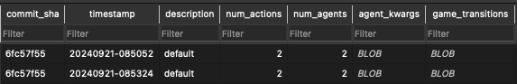
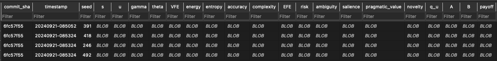

# Data Collection

When running experiments using the `simulation.IteratedGame` class, the method `IteratedGame.run()` takes a(n optional) `collect_variables` list of the names of agent attributes to be collected each timestep. 
This can include any agent attributes, for example `agent.q_u`, or `agent.gamma`, or `agent.dynamic_precision`.
The `IteratedGame` class will collect these variables for each agent at each timestep, and store them in a dictionary. The dictionary is returned by the `IteratedGame.run()` method. 
Generally here we specify variables (attributes) that change every time step.

The function `simulation.simulate()` is a wrapper that allows one to run `IteratedGame.run()` multiple times with different seeds and collect the results in a list of dictionaries. 
If a **database path** is provided, the results will be stored in the database (and the database will be created if it doesn't exist).
The results are stored in two differnent tables:

### Metadata Table

This table contains the metadata for each run, including the seed, the parameters of the run, and the initial state of the agents.
- `commit_sha` (string) the commit hash of the code used to run the experiment (short version, i.e. 8 characters)
- `timestamp` (string) in `YYYYMMDD-HHMMSS` format
- `description`: (string; optional) experiment description string, provided by the user
- `num_agents`: (int) number of agents in the experiment
- `num_actions`: (int) number of actions in the games
- `agent_kwargs`: (pickled dictionary) initial agent configuration parameters
- `game_transitions`: (pickled tuple) specified game transitions, including game label, payoff matrix, and duration of the game

Example of the `metadata` table:



### Timeseries Table

This table contains the timeseries data for each agent at each timestep, pickled (I am going to hell for this)

Example of the `timeseries` table (not showing all columns):



## Examples

Canonical pattern to retrieve data from the database:

```python
TIMESTAMP = '20240920-123043'
RESULTS_DB_PATH = 'my-results.db'

print(f'Retrieving data matching {TIMESTAMP} from database {RESULTS_DB_PATH}')
metadata = utils.database.retrieve_timeseries_matching(
    db_path=RESULTS_DB_PATH,
    sql_query=(
        'SELECT * FROM metadata '
        f'WHERE timestamp LIKE "%{TIMESTAMP}%" '
        # 'AND description LIKE "%{DESCRIPTION}%" '
    )
)
game_transitions = pickle.loads(metadata.iloc[0]['game_transitions'])
agent_kwargs = pickle.loads(metadata.iloc[0]['agent_kwargs'])
commit_sha = metadata.iloc[0]['commit_sha']
description = metadata.iloc[0]['description']
timestamp = metadata.iloc[0]['timestamp']
num_players = metadata.iloc[0]['num_agents']

experiments = utils.database.retrieve_timeseries_matching(
    db_path=RESULTS_DB_PATH,
    sql_query=(
        'SELECT * FROM timeseries '
        f'WHERE timestamp LIKE "%{timestamp}%" '
        f'AND commit_sha LIKE "%{commit_sha}%" '
    )
)
print(f'Found {len(experiments)} matching experiments')
```

To select experiments by `description`, first we need to retrieve the matching `commit_sha` and `timestamp` from the `metadata` table. Then we can use these values to filter the `experiments` table. Example:

```python
timestamp_query = '20240920-12'
sql_query = f"SELECT * FROM metadata WHERE timestamp LIKE '%{timestamp_query}%' AND description LIKE '%2x2 no interoception%'"
metadata = utils.database.retrieve_timeseries_matching(sql_query=sql_query, db_path=RESULTS_DB_PATH)

commit_sha = metadata.iloc[0]['commit_sha']
timestamp = metadata.iloc[0]['timestamp']

metadata  # <--- this will show the metadata for the selected experiments

sql_query = f"SELECT * FROM timeseries WHERE timestamp LIKE '%{timestamp}%' AND commit_sha LIKE '%{commit_sha}%'"
experiments = utils.database.retrieve_timeseries_matching(sql_query=sql_query, db_path=RESULTS_DB_PATH)

experiments  # <--- this will show the timeseries data for the selected experiments
```

## Interface

The `utils/database.py` module provides functions to interact with the database.